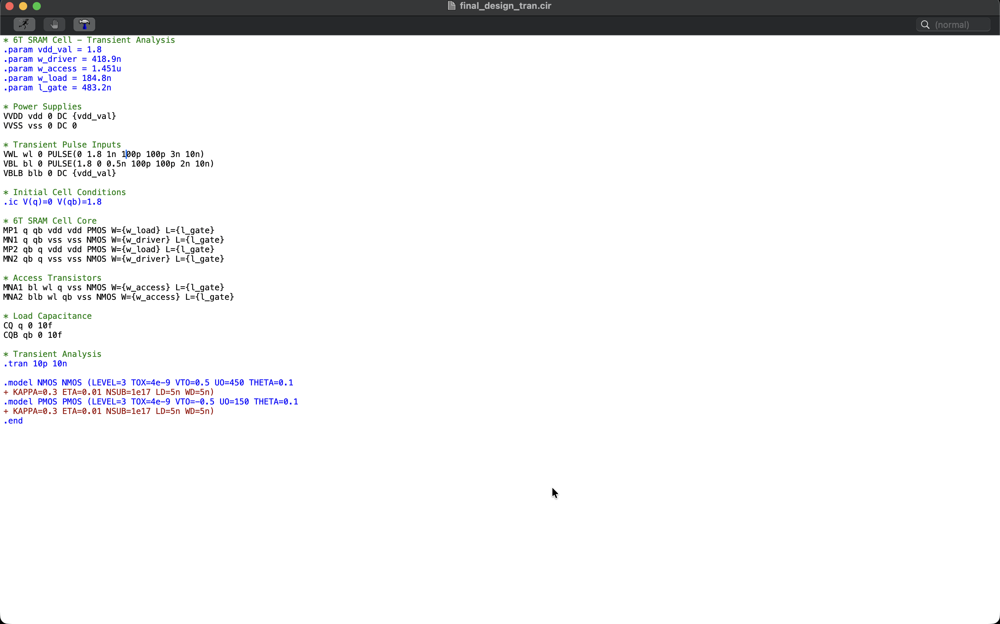
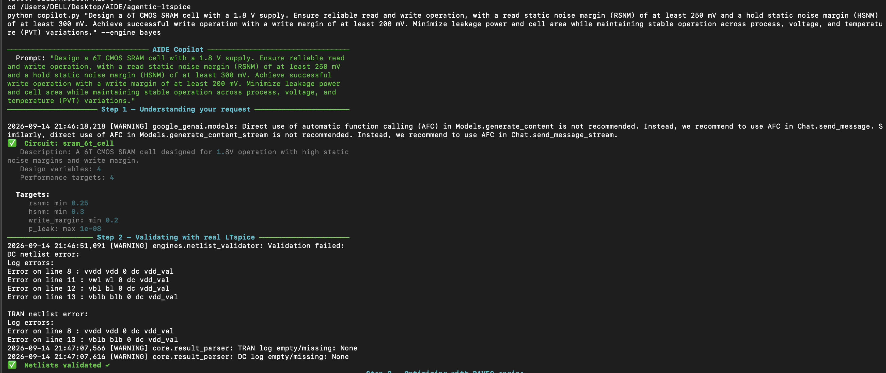
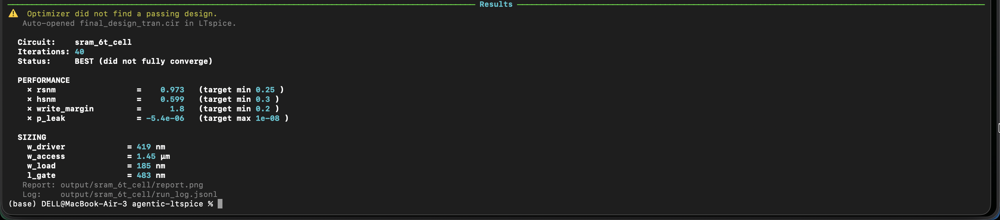
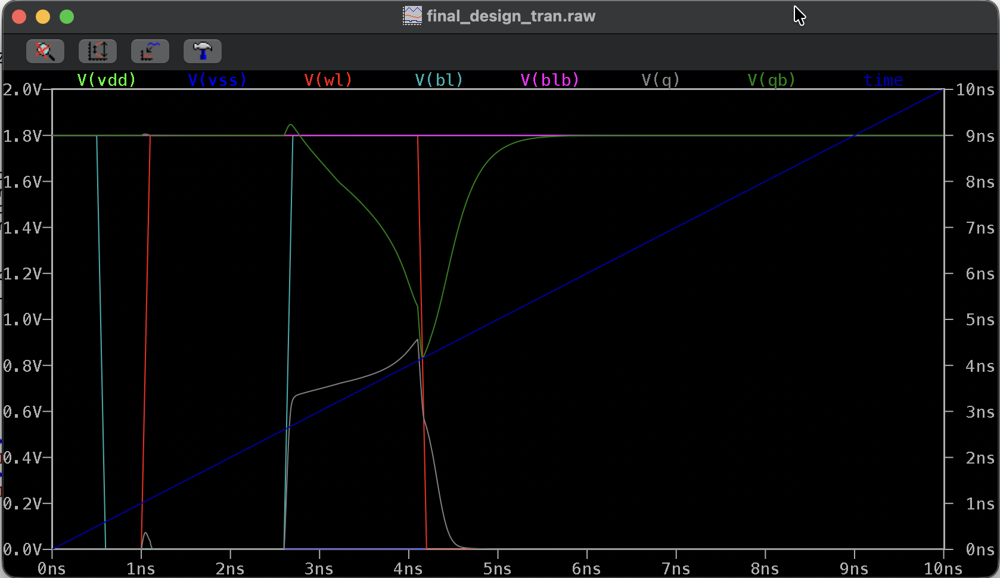

<div align="center">

# 🔬 AIDE — AI-Driven Analog Design Explorer

[](LICENSE)
[](https://www.python.org/downloads/)
[](https://www.analog.com/ltspice)
[](https://optuna.org/)

**An AI-driven analog design copilot that converts natural-language specifications into simulation-verified, optimized transistor sizing.**

AIDE combines **LLM-based circuit generation, LTspice validation, Bayesian optimization, Monte Carlo analysis, and PVT testing** into an automated closed-loop design flow.

</div>

---

## 📌 What AIDE Does

Analog transistor sizing is usually iterative: choose device sizes, run LTspice, inspect waveforms, adjust parameters, and repeat until the design meets its targets.

AIDE turns that process into an automated optimization loop.

```text
Natural-language specification
            ↓
      LLM circuit generation
            ↓
     SPICE/netlist validation
            ↓
        LTspice simulation
            ↓
      Result extraction
            ↓
   Bayesian / LLM optimization
            ↓
      Best design candidate
            ↓
       PVT + Monte Carlo
            ↓
       Final report
```

For example, a specification such as:

> **Design a CMOS inverter with VDD = 1.8 V, switching point near 0.5×VDD, and propagation delay below 200 ps.**

can be passed directly to the copilot. The specification layer in `spec.yaml` defines the circuit, search bounds, targets, PVT corners, Monte Carlo tolerance, and optimization budget. fileciteturn10file0

---

## ✨ Key Capabilities

### 🤖 1. LLM-driven circuit generation
AIDE converts a natural-language analog design request into an initial SPICE representation and identifies the design variables that may be optimized.

### 🩹 2. Self-healing simulation loop
Generated SPICE is validated through LTspice. When the generated circuit contains a simulation error, AIDE captures the failure and feeds the relevant error information back into the agent so it can correct the candidate instead of stopping the whole workflow.

### 📐 3. Bayesian optimization
The default optimization engine uses **Optuna** to intelligently explore transistor widths and lengths rather than performing a naïve brute-force sweep.

Each trial follows:

```text
Candidate device sizes
        ↓
 Generate/edit SPICE
        ↓
    LTspice run
        ↓
 Parse simulation metrics
        ↓
   Objective score
        ↓
 Next candidate
```

### 🧪 4. PVT + Monte Carlo robustness testing
After optimization, AIDE evaluates the selected design across configurable temperature and supply corners and runs statistical variation experiments to estimate robustness and yield.

The current example specification evaluates **−40°C, 27°C, and 125°C** with **VDD ±10%**, together with a **10% device-tolerance Monte Carlo target**. fileciteturn10file0

### 📊 5. Automated reporting
The final stage produces visual summaries of the optimization process and reliability analysis so that the engineer can inspect convergence and final performance without manually collecting simulation results.

---

## 🖥️ Screenshots

### 1. LTspice simulation



The LTspice view shows the actual circuit simulation used as the physics/measurement backend. **AIDE does not replace the simulator; it automates the surrounding design loop.**

### 2. Optimization / terminal workflow



This view shows the agentic optimization process as AIDE iterates over candidate device sizes, evaluates the simulated metrics, and searches toward the target.

### 3. Optimization progress



AIDE exposes the iterative search so the optimization process is observable rather than being a black box.

### 4. Final output / report



The generated output summarizes the final candidate and the measured performance used to decide whether the design satisfies the requested specification.

---

## 🧠 Architecture

```text
                           ┌──────────────────────┐
                           │ Natural Language Spec│
                           └──────────┬───────────┘
                                      ↓
                           ┌──────────────────────┐
                           │   LLM Agent / Parser  │
                           └──────────┬───────────┘
                                      ↓
                           ┌──────────────────────┐
                           │   SPICE Netlist       │
                           │ Generation / Editing  │
                           └──────────┬───────────┘
                                      ↓
                           ┌──────────────────────┐
                           │ Semantic + Netlist   │
                           │      Validation      │
                           └──────────┬───────────┘
                                      ↓
                           ┌──────────────────────┐
                           │      LTspice          │
                           │   Simulation Engine   │
                           └──────────┬───────────┘
                                      ↓
                           ┌──────────────────────┐
                           │ Result / Metric Parser│
                           └──────────┬───────────┘
                                      ↓
                    ┌─────────────────┴─────────────────┐
                    ↓                                   ↓
          ┌──────────────────┐                ┌──────────────────┐
          │ Bayesian Optuna  │                │    LLM Engine    │
          │    Optimizer     │                │  (alternative)   │
          └────────┬─────────┘                └────────┬─────────┘
                   └─────────────────┬─────────────────┘
                                     ↓
                           ┌──────────────────────┐
                           │ Best Design Candidate│
                           └──────────┬───────────┘
                                      ↓
                           ┌──────────────────────┐
                           │      PVT / MC         │
                           │ Reliability Analysis │
                           └──────────┬───────────┘
                                      ↓
                           ┌──────────────────────┐
                           │     Final Report      │
                           └──────────────────────┘
```

### Core implementation layers

| Layer | Responsibility |
|---|---|
| `core/` | Specification handling, simulation execution, result parsing, validation, and netlist editing |
| `engines/` | Bayesian optimization, LLM agent, circuit generation, and semantic/netlist validation |
| `reliability/` | PVT and Monte Carlo evaluation |
| `templates/` | Reusable LTspice circuit templates |
| `report.py` | Automated result/report generation |
| `spec.yaml` | Single source of truth for circuit target, variables, limits, corners, and run budget |

The repository is deliberately modular so that the simulator, optimizer, circuit generator, validators, and reliability stages can evolve independently. fileciteturn9file0

---

## 🚀 Quick Start

### Prerequisites

- Python 3.10+
- LTspice
- Google Gemini API key for the LLM path

### Install

```bash
git clone https://github.com/karann0077/AIDE.git
cd AIDE
pip install -r requirements.txt
```

Create your environment file:

```bash
cp .env.example .env
```

Then configure:

```bash
GOOGLE_API_KEY=your_key_here
```

### Run a design request

```bash
python copilot.py "Design a CMOS inverter with a 1.8 V supply, switching point near 0.5VDD, and propagation delay below 200 ps."
```

The same entry point can be used interactively by running:

```bash
python copilot.py
```

---

## ⚙️ Example Specification

The current `spec.yaml` uses a CMOS inverter target with:

```yaml
target:
  vm_ratio: 0.5
  vm_tolerance: 0.05
  tpd_max_ns: 0.20
  vdd_nominal: 1.8
```

and exposes transistor width/length bounds to the optimization engine. fileciteturn10file0

This makes the workflow **specification-driven** instead of hard-coding a single transistor-sizing experiment.

---

## 🔬 Optimization Engines

### `--engine bayes`

The default path uses **Bayesian optimization**. This is the recommended mode for repeatable automated sizing because the optimizer learns from previous trials and focuses simulation budget on promising regions.

### `--engine llm`

The alternative mode lets the LLM propose sizing changes using the observed simulation history and engineering context.

The important architectural distinction is that **LTspice remains the source of truth for circuit behavior**. Optimization and LLM components propose candidates; simulation determines whether those candidates actually work.

---

## 🧪 Reliability Validation

The reliability stage is designed to answer a more useful question than simply:

> "Did one nominal simulation pass?"

AIDE also asks:

- Does the circuit remain within specification across temperature?
- What happens when the supply changes?
- How sensitive is performance to device variation?
- What fraction of randomized trials remain within the target?

This is why the project goes beyond a one-shot SPICE generation demo and becomes a **closed-loop analog design exploration workflow**.

---

## 🛡️ Robustness & Edge Cases

AIDE contains explicit handling for several practical automation problems:

| Failure / Edge Case | Handling |
|---|---|
| LTspice simulation failure | Detect failed runs and penalize invalid candidates instead of crashing the optimization loop |
| Out-of-range transistor sizes | Clamp candidate variables to configured search bounds |
| macOS path issues | Normalize simulation paths to absolute paths |
| LTspice log encoding differences | Detect and decode platform-specific text output |
| Invalid generated netlists | Run validation before treating a candidate as usable |

---

## 🧪 Testing

The repository includes offline tests that can be run without an active LTspice session:

```bash
python -m pytest tests/ -v
```

---

## 🎯 Why This Is Different

Traditional analog design automation typically requires the engineer to manually connect multiple pieces:

```text
Specification
   ↓
Manual schematic/netlist editing
   ↓
Manual simulation
   ↓
Manual measurement
   ↓
Manual sizing changes
   ↓
Repeat
```

AIDE closes that loop:

```text
Specification
      ↓
     AIDE
      ↓
Candidate generation
      ↓
Simulation
      ↓
Measurement
      ↓
Optimization
      ↓
Reliability validation
      ↓
Final design
```

That makes AIDE less like a chatbot and more like a **design-space exploration and automation framework around LTspice**.

---

## 📜 License

This project is licensed under the MIT License. See [LICENSE](LICENSE).

---

<div align="center">

**The agent proposes. LTspice measures. The optimizer searches. Reliability analysis validates.**

</div>
